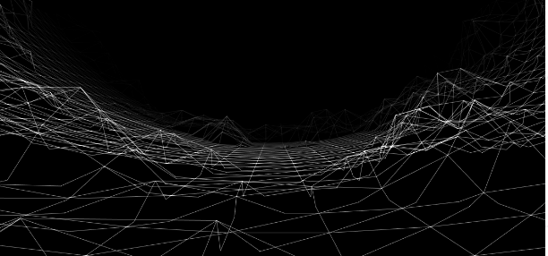

###### The image is just a demonstration of how the program works

# FdF: An Underrated Project in the Trio (so_long, FdF, fract’ol)

FdF, compared to the more popular so_long, represents a unique opportunity for anyone looking to delve into 3D rendering. This project goes beyond classic 2D by offering extreme possibilities in 3D representation, with applications not only in **game development** but also in **graphic modeling**, 3D simulations, and complex data visualization. Here’s a summary and clarification of the main challenges tackled:

## 1. Accumulating the Theory of Perspective Projections
	•	Initial confusion about the required perspective: The project initially seems to require a frontal perspective (orthogonal projection), which would affect depth handling and mapping behavior.
	•	Isometric projection: Understanding isometric projection required detailed study of axis transformations. This type of projection is widely used in stylized 3D video games but also in CAD design (computer-aided drafting) and digital geographic maps, where perspective distortion is avoided.
	•	Potential bonus addition: Implementing a dynamic frontal perspective with depth handling (W axis) could be an advanced extension of the project.

## 2. Rotation Matrices and Axis Transformations
	•	Rotation matrices were one of the main technical challenges. Understanding them is essential for manipulating objects in 3D space.
	•	The greatest difficulty was breaking down the mathematical concept into practical code, managing rotations for the X, Y, and Z axes independently while keeping them consistent with isometric projection.
	•	These techniques are also applied in fields such as robotics (to calculate spatial movements) and scientific visualization (to render complex objects like molecules or data flows).

## 3. Managing Original Coordinates and Cumulative Transformations
	•	Problem: Modifying X, Y, and Z coordinates directly during each transformation leads to imprecise results, as each subsequent operation relies on already-transformed coordinates, accumulating errors or unwanted dependencies.
	•	Solution:
	1.	Keep a set of original coordinates intact.
	2.	Create a cumulative matrix that sums all transformations (rotations, scaling, translations).
	3.	Apply this cumulative matrix only during rendering, ensuring every transformation remains independent and based on the original coordinates.
	•	This approach is widely used in 3D animations, physical simulations, and augmented reality applications, where precision and flexibility are crucial.

## 4. Memory and Performance Optimization
	•	Problem: Memory consumption grows with map complexity and the number of operations per second.
	•	Solution:
	•	Convert memory allocations from static to “disposable” processes, where memory is dynamically allocated and freed for temporary operations.
	•	This reduces RAM usage but requires optimization to maintain high FPS (frames per second).
	•	The optimization techniques developed in FdF can also be adapted for interactive simulations and handling complex data in scientific or industrial visualization applications.

# Conclusion

FdF requires an advanced understanding of applied mathematics and resource optimization. The main challenges involve:
	1.	The theory of perspective and isometric projections.
	2.	The implementation and management of rotation matrices.
	3.	A strategy based on original coordinates and cumulative transformations.
	4.	Memory optimization to support larger maps and smoother operations.

FdF is not just an entry point into game development but also provides a solid foundation for work in fields like CAD design, 3D simulations, **virtual reality**, and **data visualization**, making it an extremely versatile and educational project.